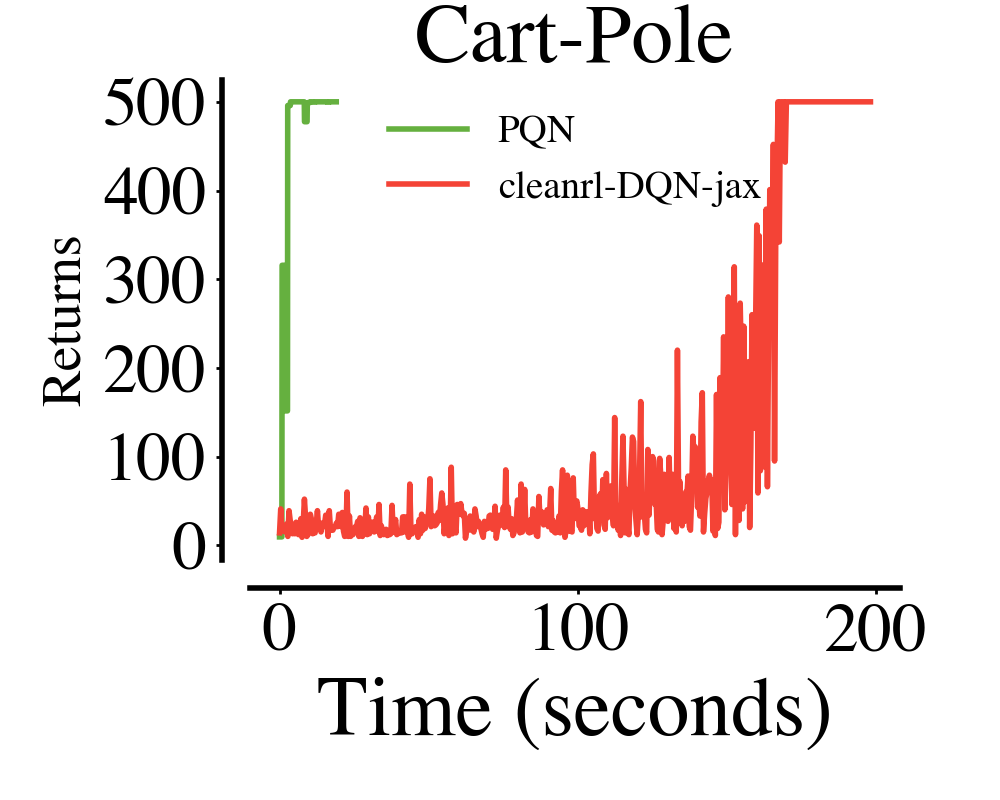
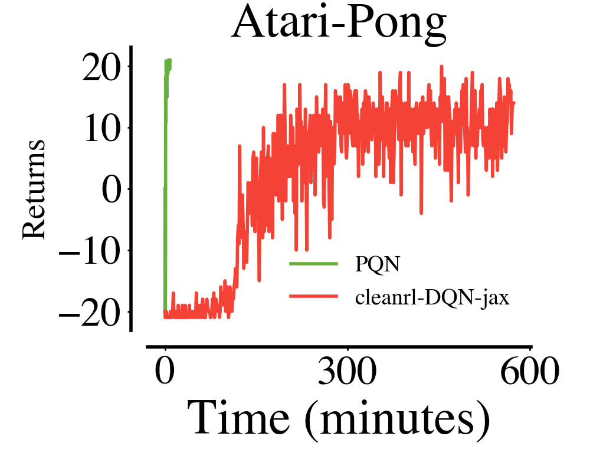
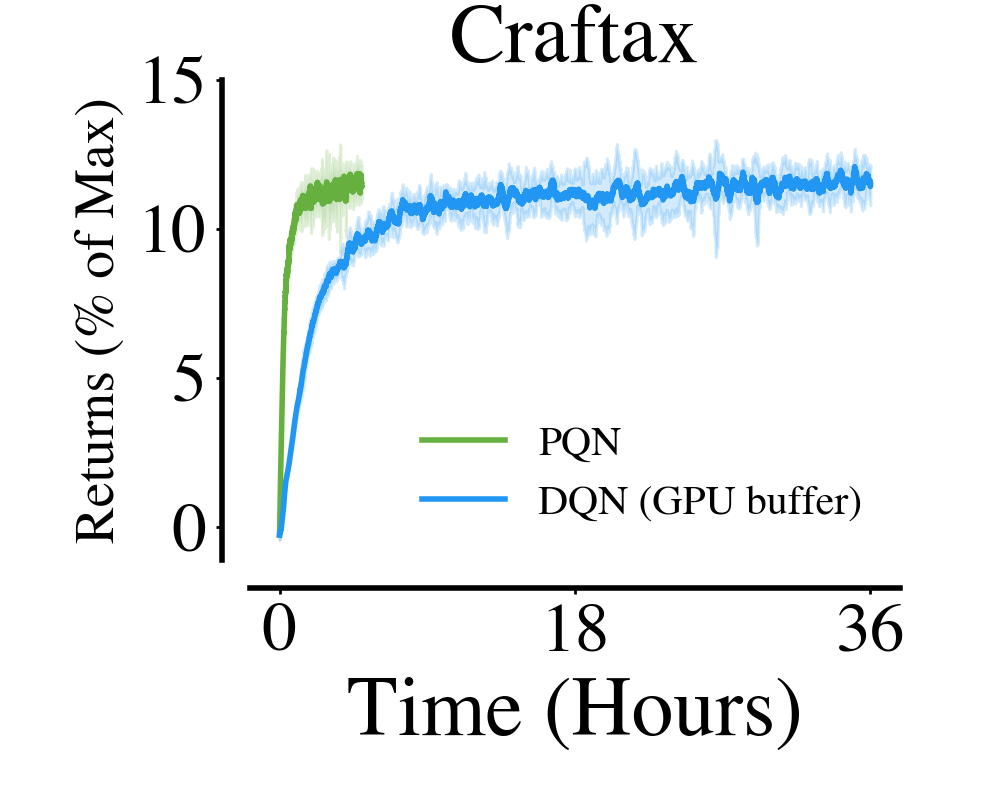
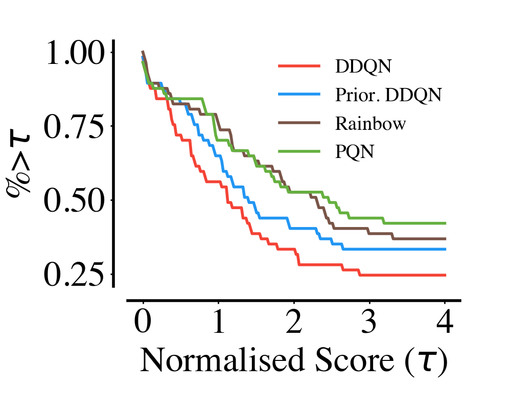
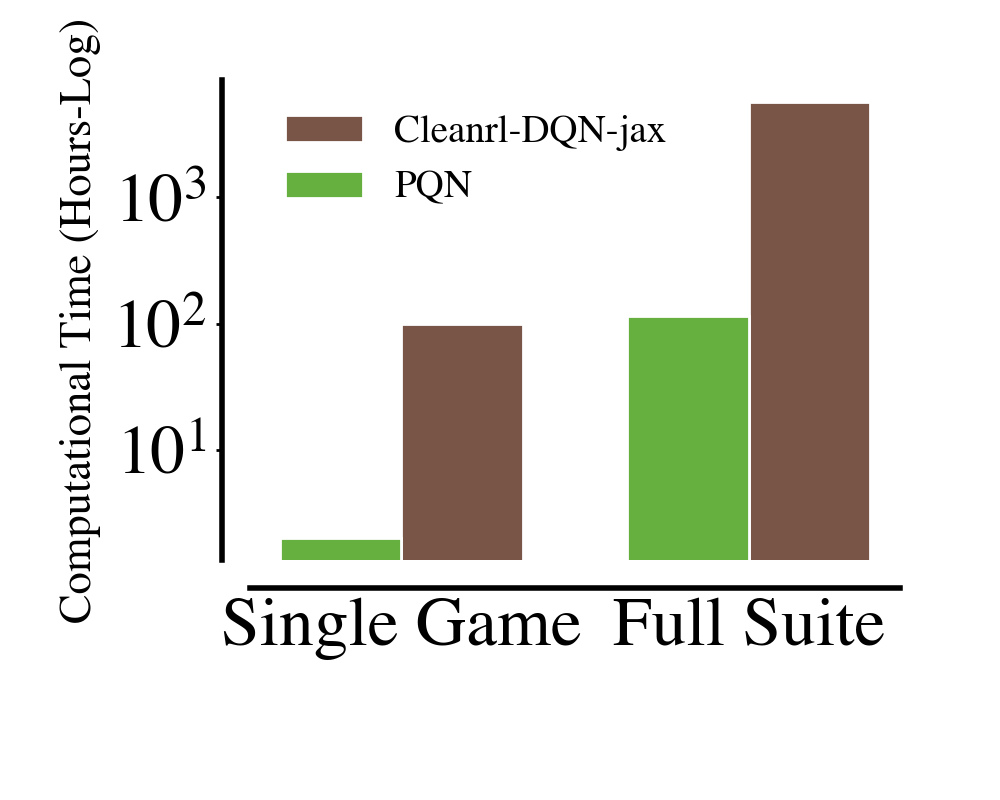
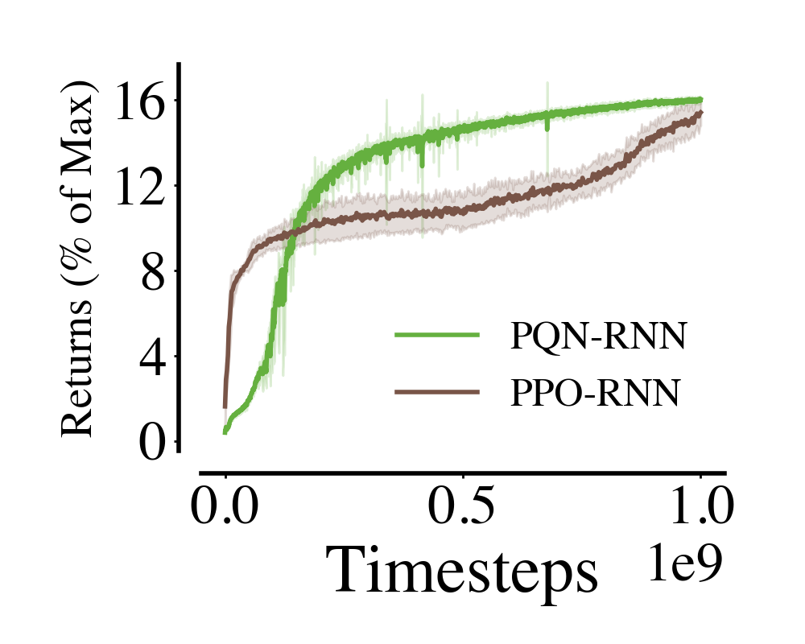
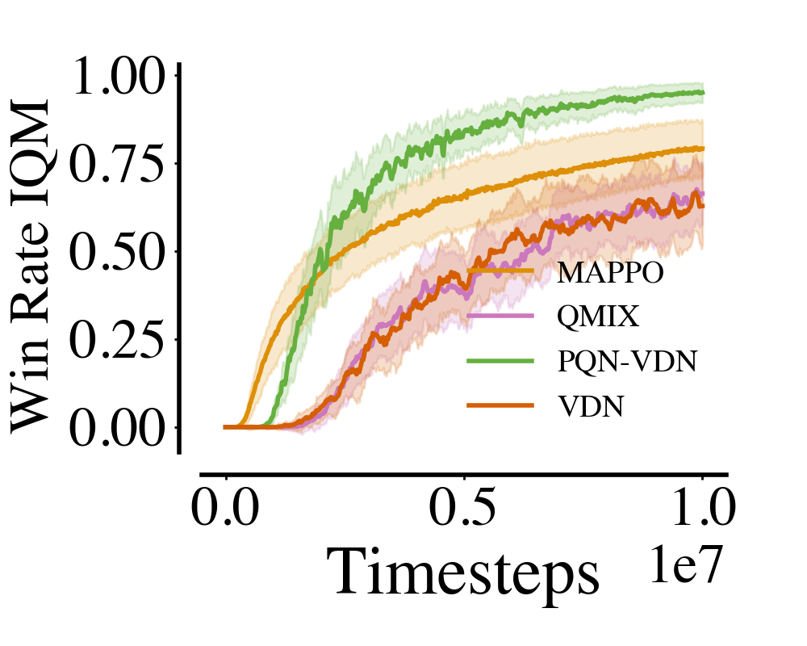
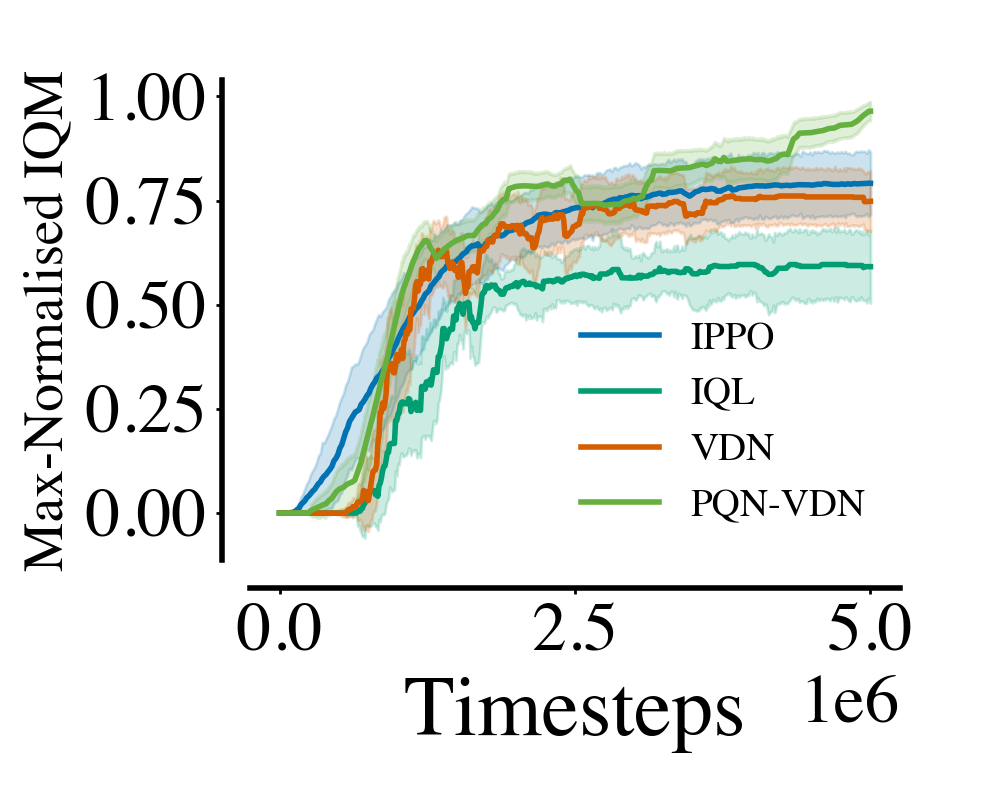

# Exploring Q-Learning in Pure-GPU Setting

[](https://github.com/mttga/purejaxql/blob/main/LICENSE)
[](https://github.com/psf/black)
[](https://arxiv.org/abs/2407.04811)

The goal of this project is to provide very simple and lightweight scripts for Q-Learning baselines in various single-agent and multi-agent settings that can run effectively on pure-GPU environments. It follows the [cleanrl](https://github.com/vwxyzjn/cleanrl) philosophy of single-file scripts and is deeply inspired by [purejaxrl](https://github.com/luchris429/purejaxrl/tree/main), which aims to compile entire RL pipelines on the GPU using JAX.

The main algorithm currently supported is the [Parallelised Q-Network (PQN)](https://arxiv.org/abs/2407.04811), developed specifically to run effectively in a pure-GPU setting. The main features of PQN are:
1. **Simplicity**: PQN is a very simple baseline, essentially an online Q-learner with vectorized environments and network normalization.
2. **Speed**: PQN runs without a replay buffer and target networks, ensuring significant speed-ups and sample efficiency.
3. **Stability**: PQN can use both batch and layer normalization to stabilize training.
4. **Flexibility**: PQN is easily compatible with RNNs, Peng's $Q(\lambda)$, and multi-agent tasks.

## 🔥 Quick Stats

With PQN and a single NVIDIA A40 (achieving similar performance to an RTX 3090), you can:
- 🦿 Train agents for simple tasks like CartPole and Acrobot in a few seconds.
  - Train thousands of seeds in parallel in a few minutes.
  - Train MinAtar in less than a minute, and complete 10 parallel seeds in less than 5 minutes.
- 🕹️ Train an Atari agent for 200M frames in one hour (with environments running on a single CPU using [Envpool](https://github.com/sail-sg/envpool), tested on an AMD EPYC 7513 32-Core Processor).
  - Solve simple games like Pong in a few minutes and less than 10M timesteps.
- 👾 Train a Q-Learning agent in Craftax much faster than when using a replay buffer.
- 👥 Train a strong Q-Learning baseline with VDN in multi-agent tasks.

<table style="width: 100%; text-align: center; border-collapse: collapse;">
  <tr>
    <td style="width: 33.33%; vertical-align: top; padding: 10px;">
      <h3>Cartpole</h3>
      
      <h4><i>It takes a few seconds to train on simple tasks, also with dozens of parallel seeds.</i></h4>
    </td>
    <td style="width: 33.33%; vertical-align: top; padding: 10px;">
      <h3>Atari</h3>
      
      <h4><i>With PQN you can solve simple games like Pong in less than 5 minutes.</i></h4>
    </td>
    <td style="width: 33.33%; vertical-align: top; padding: 10px;">
      <h3>Craftax</h3>
      
      <h4><i>Training an agent in Craftax with PQN is faster than using a replay buffer.</i></h4>
    </td>
  </tr>
</table>

## 🦾 Performances

### Atari

Currently, after around 4 hours of training and 400M environment frames, PQN can achieve a median score similar to the original Rainbow paper in ALE, reaching scores higher than humans in 40 of the 57 Atari games. While this is far from the latest SOTA in ALE, it can serve as a good starting point for faster research in ALE.

<table style="width: 100%; text-align: center; border-collapse: collapse;">
  <tr>
    <td style="width: 33.33%; vertical-align: top; padding: 10px;">
      <h4>Median Score</h4>
      
    </td>
    <td style="width: 33.33%; vertical-align: top; padding: 10px;">
      <h4>Performance Profile</h4>
      
    </td>
    <td style="width: 33.33%; vertical-align: top; padding: 10px;">
      <h4>Training Speed</h4>
      
    </td>
  </tr>
</table>

### Craftax

When combined with an RNN network, PQN offers a more sample-efficient baseline compared to PPO. As an off-policy algorithm, PQN could be an interesting starting point for population-based training in Craftax!

<div style="text-align: center; margin: auto;">
  
</div>

### Multi-Agent (JaxMarl)

When combined with Value Decomposition Networks, PQN is a strong baseline for multi-agent tasks.

<table style="width: 100%; margin: auto; text-align: center; border-collapse: collapse;">
  <tr>
    <td style="width: 50%; vertical-align: top; padding: 10px;">
      <h4>Smax</h4>
      
    </td>
    <td style="width: 50%; vertical-align: top; padding: 10px;">
      <h4>Overcooked</h4>
      
    </td>
  </tr>
</table>

## 🚀 Usage (highly recommended with Docker)

Install with pip:

```bash
pip install git+https://github.com/mttga/purejaxql
```

Install with Docker:

1. Ensure you have Docker and the [NVIDIA Container Toolkit](https://docs.nvidia.com/datacenter/cloud-native/container-toolkit/latest/install-guide.html) properly installed.
2. (Optional) Set your WANDB key in the [Dockerfile](docker/Dockerfile).
3. Build with `bash docker/build.sh`.
4. (Optional) Build the specific image for Atari (which uses different gym requirements): `bash docker/build_atari.sh`.
5. Run a container: `bash docker/run.sh` (for Atari: `bash docker/run_atari.sh`).
6. Test a training script: `python purejaxql/pqn_minatar.py +alg=pqn_minatar`.

#### Useful commands:

```bash
# cartpole
python purejaxql/pqn_gymnax.py +alg=pqn_cartpole
# train in atari with a specific game
python purejaxql/pqn_atari.py +alg=pqn_atari alg.ENV_NAME=NameThisGame-v5
# pqn rnn with craftax
python purejaxql/pqn_rnn_craftax.py +alg=pqn_rnn_craftax
# pqn-vdn in smax
python purejaxql/pqn_vdn_rnn_jaxmarl.py +alg=pqn_vdn_rnn_smax
# Perform hyper-parameter tuning
python purejaxql/pqn_gymnax.py +alg=pqn_cartpole HYP_TUNE=True
```

## Experiment Configuration

Check [```purejaxql/config/config.yaml```](purejaxql/config/config.yaml) for the default configuration. It allows you to set up WANDB, seed, and choose the number of parallel seeds per experiment.

The algorithm-environment specific configuration files are in [```purejaxql/config/alg```](purejaxql/config/alg).

Most scripts include a ```tune``` function to perform hyperparameter tuning. You'll need to set ```HYP_TUNE=True``` in the default config file to use it.

## Citation

If you use PureJaxRL in your work, please cite the following paper:

```
@misc{gallici2024simplifyingdeeptemporaldifference,
      title={Simplifying Deep Temporal Difference Learning}, 
      author={Matteo Gallici and Mattie Fellows and Benjamin Ellis and Bartomeu Pou and Ivan Masmitja and Jakob Nicolaus Foerster and Mario Martin},
      year={2024},
      eprint={2407.04811},
      archivePrefix={arXiv},
      primaryClass={cs.LG},
      url={https://arxiv.org/abs/2407.04811}, 
}
```

## Related Projects

The following repositories are related to pure-GPU RL training:

- [PureJaxRL](https://github.com/luchris429/purejaxrl)
- [JaxMARL](https://github.com/FLAIROx/JaxMARL)
- [Jumanji](https://github.com/instadeepai/jumanji)
- [JAX-CORL](https://github.com/nissymori/JAX-CORL)
- [JaxIRL](https://github.com/FLAIROx/jaxirl)
- [Pgx](https://github.com/sotetsuk/pgx)
- [Mava](https://github.com/instadeepai/Mava)
- [XLand-MiniGrid](https://github.com/corl-team/xland-minigrid)
- [Craftax](https://github.com/MichaelTMatthews/Craftax/tree/main)
